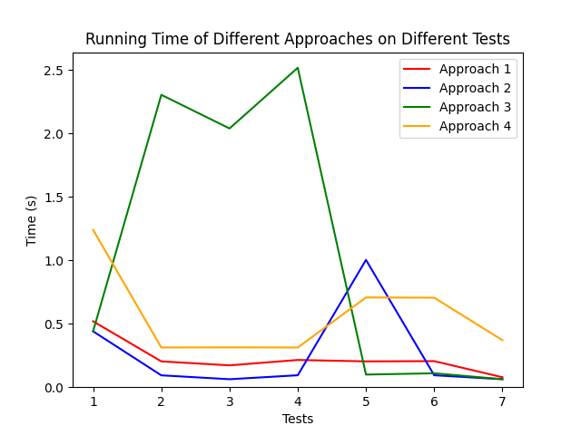
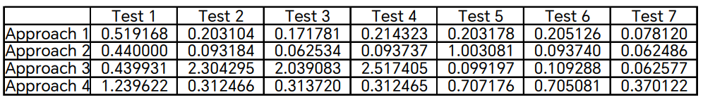

# CS3334 Project Report

## Introduction

The main goal of this project is to design different data structures and algorithms and apply them to solve a problem, and analyze their time complexity.

The problem is as follows:

> Given an array of integers, find all the duplicate elements in the array, and output them in the order of their first appearance.

In this project, I have implemented 4 different approaches and compared their time complexity.

## Approaches

### Approach 1: Array + Brute Force

Initially mark all the elements in the array as unvisited.

For each unvisited element in the array, check if there are any duplicate elements after it. If any, output it, and mark all the duplicate elements as visited, so that they will not be output again.

Code can be found in [`1.cpp`](1.cpp).

#### Average Time Complexity: $\mathcal{O}(n^2)$

Two nested loops are used in this approach.

- The array is iterated through once, so the outer loop is $\mathcal{O}(n)$.
    - For each element, if it is unvisited, the part of the array after it is iterated through, so the inner loop is $\mathcal{O}(n)$.

Therefore, the average time complexity is $\mathcal{O}(n^2)$.

#### Worst Time Complexity: $\mathcal{O}(n^2)$

In the worst case, the analysis is the same as the average case. So the worst time complexity is also $\mathcal{O}(n^2)$.

The worst case happens when there are no duplicate elements in the array, so all elements are unvisited. In this case, the inner loop is executed for all elements in the array.

### Approach 2: Hash Table

Maintain a hash table to store the elements that have appeared.

First, iterate through the array and insert all the elements into the hash table. In addition to the value, the number of appearance of each element is also stored in the hash table.

Then, iterate through the array again. For each element, check if it has appeared more than once. If it has, output it, and mark its appearance as 0, so that the following duplicates will not be output.

Code can be found in [`2.cpp`](2.cpp).

The solution implements the hash table using quadratic probing, with the table size a prime number $p > 2n$ (where $n$ is the number of elements in the array), and the primary hash function $h(k) = k \mod p$.

#### Average Time Complexity: $\mathcal{O}(n)$

One loop is used in this approach.

- The array is iterated through twice, which is $\mathcal{O}(n)$.
    - Inserting and checking an element in the hash table has an average time complexity of $\mathcal{O}(1)$. This is because in average case, the number of collisions is small and the load factor $\alpha \leq\frac np < \frac{1}{2}$. Therefore, each operation on the hash table involves constant number of comparisons, so the average time complexity is $\mathcal{O}(1)$.

Therefore, the average time complexity is $\mathcal{O}(n)$.

#### Worst Time Complexity: $\mathcal{O}(n^2)$

- The array is iterated through twice, which is $\mathcal{O}(n)$.
    -  Inserting and checking an element in the hash table has a worst time complexity of $\mathcal{O}(n)$. This happens when collisions happen for all elements, so for accessing each element, the hash table has to first iterate through all occupied slots to find the element.

Therefore, the worst time complexity is $\mathcal{O}(n^2)$.

The worst case happens when all the elements in the array are hashed to the same slot with the primary hash function, but no duplicate elements exist.

Given that the primary hash function is $h(k) = k \mod p$, the worst case happens when all the elements $a_i$ is congruent to $a_0$ modulo $p$, i.e. $a_i \equiv a_0 \mod p$, or $a_i = a_0 + p \times k$ for some integer $k$. The solution uses $p = 20011$, which will be later used in the test cases.

### Approach 3: Binary Search Tree

Maintain a BST to store the elements that have appeared.

First, iterate through the array and insert all the elements into the BST. In addition to the value, the number of appearance of each element is also stored in the BST.

Then, iterate through the array again. For each element, check if it has appeared more than once. If it has, output it, and mark its appearance as 0, so that the following duplicates will not be output.

Code can be found in [`3.cpp`](3.cpp).

#### Average Time Complexity: $\mathcal{O}(n\log n)$

One loop is used in this approach.

- The array is iterated through twice, which is $\mathcal{O}(n)$.
    - Inserting and checking an element in the BST has an average time complexity of $\mathcal{O}(\log n)$. This is because the expected height of a BST is $h=\log n$. Each operation on the BST involves at most $h$ comparisons, so the average time complexity is $\mathcal{O}(\log n)$.

Therefore, the average time complexity is $\mathcal{O}(n\log n)$.

#### Worst Time Complexity: $\mathcal{O}(n^2)$

- The array is iterated through twice, which is $\mathcal{O}(n)$.
    - Inserting and checking an element in the BST has a worst time complexity of $\mathcal{O}(n)$. This happens when the BST is unbalanced, so the height of the BST is at most $h=n$, so the worst time complexity is $\mathcal{O}(n)$.

Therefore, the worst time complexity is $\mathcal{O}(n^2)$.

The worst case happens when the elements in the array are sorted, either ascendingly or descendingly. In this case, the BST is degenerated into a linked list.

### Approach 4: Quick Sort + Binary Search

For each element $a_i$ at index $i$ in the array, denote a structure $b_i=(a_i, i)$ which stores the value and the index of the element.

First, iterate through the given array $\{a_i\}$ and construct a structure array $\{b_i\}$.

Then, sort the structure array $\{b_i\}$ using quick sort. For two structures $b_i$ and $b_j$, $b_i < b_j$ is defined as:

- $b_i.a < b_j.a$, or
- $b_i.a = b_j.a$ and $b_i.i < b_j.i$.

Therefore, in the sorted structure array, elements with the same value will be adjacent, and further sorted by their index ascendingly.

Finally, iterate through the given array $\{a_i\}$ again. For each element $a_i$, use binary search to locate the structure $b_i=(a_i, i)$ in the sorted structure array $\{b_i\}$. Suppose it is located at index $j$.

If $b_{j-1}$ has a value smaller than $a_i$, and $b_{j+1}$ has a value equal to $a_i$, then $a_i$ is the first appearance of a duplicate element, so output it.

Otherwise, $a_i$ is either not a duplicate element, or not the first appearance of a duplicate element, so do nothing.

Code can be found in [`4.cpp`](4.cpp).

#### Average Time Complexity: $\mathcal{O}(n\log n)$

The solution contains 3 parts.

- Part 1: Constructing the structure array. The time complexity of this part is $\mathcal{O}(n)$. The array is iterated through once.
- Part 2: Sorting the structure array using quick sort. The average time complexity of quick sort is $\mathcal{O}(n\log n)$.
    - The structure array is sorted in a divide-and-conquer manner. Each time a pivot (the first element in the subarray) is chosen, and the subarray is partitioned into two parts: the elements smaller than the pivot, and the elements larger than the pivot. Then the two parts are sorted recursively. After recursion, the smaller part, the pivot and the larger part are concatenated to form the sorted array.
    - Ideally, each recursion divides the array into two parts with equal size. Therefore, the height of the recursion tree is $\log n$.
    - Each recursion involves $\mathcal{O}(n)$ comparisons.
    - Therefore, the average time complexity is $\mathcal{O}(n\log n)$.
- Part 3: Iterating through the array and using binary search to locate the structure. The time complexity of this part is $\mathcal{O}(n\log n)$.
    - The array is iterated through once, which is $\mathcal{O}(n)$.
    - For each element, binary search is used to locate the structure in the sorted structure array. During the binary search, for each iteration, the possible range of the target is halved. At most $\log n$ comparisons are needed, and the time complexity of a single binary search is $\mathcal{O}(\log n)$.
    - Therefore, the time complexity is $\mathcal{O}(n\log n)$.

Therefore, the average time complexity is $\mathcal{O}(n\log n)$.

#### Worst Time Complexity: $\mathcal{O}(n^2)$

The solution contains 3 parts.

- Part 1: Constructing the structure array. The time complexity of this part is $\mathcal{O}(n)$. The array is iterated through once.
- Part 2: Sorting the structure array using quick sort. The worst time complexity of quick sort is $\mathcal{O}(n^2)$.
    - This happens when the pivot is always the smallest element in the current subarray. In this case, each recursion divides the array into two parts: the smaller part with size $0$, and the larger part with size $l-1$ (where $l$ is the size of the current subarray). Therefore, the height of the recursion tree is $n$.
    - Each recursion involves $\mathcal{O}(n)$ comparisons.
    - Therefore, the worst time complexity is $\mathcal{O}(n^2)$.
- Part 3: Iterating through the array and using binary search to locate the structure. The time complexity of this part is $\mathcal{O}(n\log n)$. The analysis is the same as the average case.

Therefore, the worst time complexity is $\mathcal{O}(n^2)$.

## Tests

### Test Case Generation

To verify the correctness of the solutions, and compare their time complexity under different circumstances, I have generated 7 test cases.

All the test cases are constructed under the given constraints:

- $1 \leq n < 10^4$
- $-10^8 < a_i < 10^8$
- There exists at least one duplicate element in the array.

These test cases can be found in `tests/`:

- [`1.in`](tests/1.in): 10 tests, $n = 9,995$, the array is randomly generated.
- [`2.in`](tests/2.in): 10 tests, $n = 9,995$, all elements are distinct, except for the last element which is a duplicate. The array is sorted in ascending order.
- [`3.in`](tests/3.in): 10 tests, $n = 9,995$, the array is randomly generated, and the last element is always a duplicate. The array is sorted in ascending order.
- [`4.in`](tests/4.in): 10 tests, $n = 9,995$, the array is randomly generated, and the last element is always a duplicate. The array is sorted in descending order.
- [`5.in`](tests/5.in): 10 tests, $n = 9,995$, all elements are distinct, except for the last element which is a duplicate. All elements $a_i = 20011 \times k + C$, where $C$ is a constant and $k$ is an integer.
- [`6.in`](tests/6.in): 10 tests, $n = 9,995$, all elements are distinct, except for the last element which is a duplicate.
- [`7.in`](tests/7.in): 10 tests, $n = 9,995$, all elements are the same.

Note: $n$ is chosen to be $9,995$ because $\lfloor \frac{10^8 - (-10^8)}{20011} \rfloor = 9,994$. Therefore, if we want to generate unique elements in the form $a_i = 20011 \times k + C$, at most $9,994$ elements can be generated.

### Expected Time Complexity

For Approach 1, worst case happens when there are no duplicate elements in the array.
- its average time complexity is $\mathcal{O}(n^2)$ for test 1, 3, 4, 7.
- its worst case time complexity is $\mathcal{O}(n^2)$ for test 2, 5, 6. However, the difference between the average and the worst case is small, because the time complexity is always $\mathcal{O}(n^2)$.

For Approach 2, worst case happens when there are no duplicate elements in the array, and all the elements are congruent to $a_0$ modulo $p$.
- its average time complexity is $\mathcal{O}(n)$ for test 1, 2, 3, 4, 6, 7.
- its worst case time complexity is $\mathcal{O}(n^2)$ for test 5.

For Approach 3, worst case happens when the elements in the array are sorted, either ascendingly or descendingly.
- its average time complexity is $\mathcal{O}(n\log n)$ for test 1, 5, 6, 7.
- its worst case time complexity is $\mathcal{O}(n^2)$ for test 2, 3, 4.

For Approach 4, worst case happens when the elements in the array are sorted ascendingly.
- its average time complexity is $\mathcal{O}(n\log n)$ for test 1, 4, 5, 6, 7.
- its worst case time complexity is $\mathcal{O}(n^2)$ for test 2, 3.

The above analysis can be summarized in the following table:

| | Test 1 | Test 2 | Test 3 | Test 4 | Test 5 | Test 6 | Test 7 |
| -------- | ------ | ------ | ------ | ------ | ------ | ------ | ------ |
| Approach 1 | $\mathcal{O}(n^2)$ | $\mathcal{O}(n^2)$ |  $\mathcal{O}(n^2)$ |  $\mathcal{O}(n^2)$ |  $\mathcal{O}(n^2)$ |  $\mathcal{O}(n^2)$ |  $\mathcal{O}(n^2)$ |
| Approach 2 | $\mathcal{O}(n)$ | $\mathcal{O}(n)$ |  $\mathcal{O}(n)$ |  $\mathcal{O}(n)$ |  $\mathcal{O}(n^2)$ |  $\mathcal{O}(n)$ |  $\mathcal{O}(n)$ |
| Approach 3 | $\mathcal{O}(n\log n)$ | $\mathcal{O}(n^2)$ |  $\mathcal{O}(n^2)$ |  $\mathcal{O}(n^2)$ |  $\mathcal{O}(n\log n)$ |  $\mathcal{O}(n\log n)$ |  $\mathcal{O}(n\log n)$ |
| Approach 4 | $\mathcal{O}(n\log n)$ | $\mathcal{O}(n^2)$ |  $\mathcal{O}(n^2)$ |  $\mathcal{O}(n\log n)$ |  $\mathcal{O}(n\log n)$ |  $\mathcal{O}(n\log n)$ |  $\mathcal{O}(n\log n)$ |

### Actual Test Results

To ensure the fairness of the test, I used a Python script [`tester.py`](tester.py) to:

- Compile the solutions under same compiler flags: `-std=c++11 -O2`
- Run the solutions and measure their running time
- Report the running time of each solution on each test case as a csv file and a figure

To use the script, simply run `python tester.py` in the root directory of the project.

The following results on my machine can also be found in [`result.csv`](result.csv) and [`result.png`](result.png).

Platform: Windows 11 22H2; compiler: `g++` 10.3.0. It should be noted that platform-specific and compiler-specific optimizations may largely affect the running time.

**Running Time (s)**

### Analysis

The experimental results are basically consistent with the expected results. However, the theoretical time complexity is not necessarily the same as the complexity reflected by the running time.

From the aspect of approach:

- Approach 1:
    - Expected: $\mathcal{O}(n^2)$ for all test cases, worse for test 2, 5, 6.
    - Actual: The time is close for all test cases, but test 1 is the slowest while test 7 is the fastest. Test 2, 3, 4, 5, 6 runtimes are nearly the same.
    - Possible explanations: The theoretical worst case does not affect Approach 1 much, because the time complexity is always $\mathcal{O}(n^2)$. Therefore, test 2, 3, 4, 5, 6 are basically the same. Test 7 is the fastest, because all elements are the same, so only 1 inner loop is executed, which makes the best case time complexity $\mathcal{O}(n)$.
- Approach 2:
    - Expected: $\mathcal{O}(n)$ for test 1, 2, 3, 4, 6, 7; $\mathcal{O}(n^2)$ for test 5.
    - Actual: Test 5 is significantly slower than other test cases. Test 2, 3, 4, 6, 7 are basically the same, while test 1 is slower than them. The results are consistent with the expected results.
- Approach 3:
    - Expected: $\mathcal{O}(n\log n)$ for test 1, 5, 6, 7; $\mathcal{O}(n^2)$ for test 2, 3, 4.
    - Actual: Test 2, 3, 4 are significantly slower than other test cases. Test 5, 6, 7 are basically the same, while test 1 is slower than them. The results are consistent with the expected results.
- Approach 4:
    - Expected: $\mathcal{O}(n\log n)$ for test 1, 4, 5, 6, 7; $\mathcal{O}(n^2)$ for test 2, 3.
    - Actual: the time is close for test 2, 3, 4, 7, slower for test 5, 6, and the slowest for test 1.

From the aspect of test case:
- Test 1: Randomly generated array. Running time:  2 ($\mathcal{O}(n)$) < 3 ($\mathcal{O}(n\log n)$) < 1 ($\mathcal{O}(n^2)$) < 4 ($\mathcal{O}(n\log n)$)
    - It is unexpected that all approaches run slowly on test 1, despite not being the worst case for approach 2 and 3.
    - This may have something to do with the distribution of the random numbers, which cause frequent cache misses and thus slow down the running time.
- Test 2: Unique, ascendingly sorted array. Speed: 2 ($\mathcal{O}(n)$) < 1 ($\mathcal{O}(n^2)$) < 4 ($\mathcal{O}(n^2)$) < 3 ($\mathcal{O}(n^2)$)
    - Approach 2 is the fastest, while Approach 3 is the slowest as expected. However, despite Approach 1, 4 and 3 all have the same worst case time complexity $\mathcal{O}(n^2)$, Approach 3 is significantly slower than others.
- Test 3: Random, ascendingly sorted array. Speed: 2 ($\mathcal{O}(n)$) < 1 ($\mathcal{O}(n^2)$) < 4 ($\mathcal{O}(n^2)$) < 3 ($\mathcal{O}(n^2)$)
    - The result is similar to test 2.
- Test 4: Unique, descendingly sorted array. Speed: 2 ($\mathcal{O}(n)$) < 1 ($\mathcal{O}(n^2)$) < 4 ($\mathcal{O}(n\log n)$) < 3 ($\mathcal{O}(n^2)$)
    - Approach 4 is the fastest, while Approach 3 is the slowest as expected.
- Test 5: Unique, ascendingly sorted array, all elements are congruent to $a_0$ modulo $p$. Speed: 3 ($\mathcal{O}(n\log n)$) < 1 ($\mathcal{O}(n^2)$) < 4 ($\mathcal{O}(n\log n)$) < 2 ($\mathcal{O}(n^2)$)
    - Approach 3 is the fastest, while Approach 2 is the slowest as expected.
- Test 6: Unique array. Speed: 2 ($\mathcal{O}(n)$) < 3 ($\mathcal{O}(n\log n)$) < 1 ($\mathcal{O}(n^2)$) < 4 ($\mathcal{O}(n\log n)$)
    - Approach 2 is the fastest as expected. Approach 4 is the slowest due to large constant factors. (See next section)
- Test 7: All elements are the same. Speed: 2 = 3 = 1 < 4
    - Approach 1 has the best case time complexity $\mathcal{O}(n)$, as the inner loop is only executed once. 
    - Approach 2 has the average time complexity $\mathcal{O}(n)$. 
    - Approach 3 has the average time complexity $\mathcal{O}(n\log n)$, but since the BST only contains 1 node, it is basically as fast as Approach 1, 2.
    - Approach 4 is the slowest. Consider $b_i = (a_i, i)$ where all $a_i$ are the same, then $b_i < b_j$ for all $i < j$, so the constructed array is already sorted ascendingly. Therefore, the quick sort is degenerated into a selection sort, with the worst case time complexity $\mathcal{O}(n^2)$.

## Conclusion

Only considering the average case running time, the four approaches can be ranked as follows:
- The fastest is Approach 2, which is $\mathcal{O}(n)$ for test 1, 2, 3, 4, 6, 7.
- The second fastest is Approach 3, which is $\mathcal{O}(n\log n)$ for test 1, 5, 6, 7.
- The third fastest is Approach 1, which is $\mathcal{O}(n^2)$ for all test cases.
- The slowest is Approach 4, which is $\mathcal{O}(n\log n)$ for test 1, 4, 5, 6, 7.

The result illustrates that the asymptotic time complexity does not necessarily imply the actual running time. Many other factors can affect the running time, notably the constant factors, which is mainly decided by the number of operations in a single iteration.

For example, Approach 4 is overall the slowest. This is because Approach 4 involves many operations, including $\mathcal{O}(n)$ construction, average $\mathcal{O}(n\log n)$ sorting, and $\mathcal{O}(n\log n)$ binary search. Two $\mathcal{O}(n\log n)$ operations add up to $\mathcal{O}(n\log n)$, but at the same time, the constant factors are also added up, which makes Approach 4 slower than Approach 3.

On the other hand, Approach 2 and Approach 3 has worse performance on worst cases, compared to Approach 1 and Approach 4. This is because the degeneration of the hash table and the BST does heavily affect the running time, while quick sort is more robust to the worst case.

It should be also noted that the test cases are not comprehensive enough, for example, the test cases should also include the cases where duplicate elements are randomly distributed in the array.
